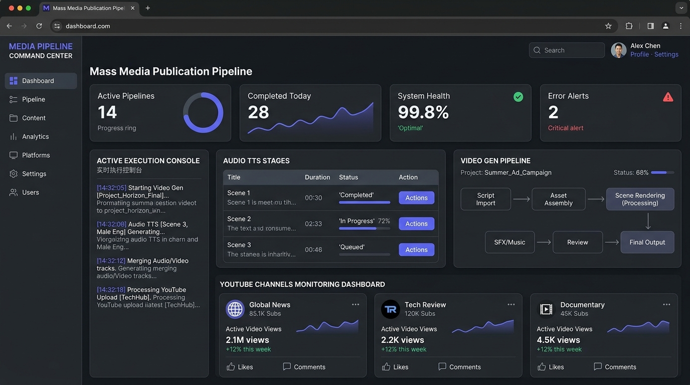

# Mass Media Publication Pipeline

> An end-to-end automated media processing engine that scrapes public-domain literature from Project Gutenberg, synthesizes studio-quality narrated chapter audio via Kokoro TTS, renders video content with visual waveforms and backgrounds via FFmpeg, and manages publication to targeted thematic YouTube channels.

---

## 🖼️ Dashboard Preview



The system includes a web dashboard providing live observability into the pipeline execution, queue states, database tables, and automated YouTube channel authentication sequences.

---

## ⚡ Key Features

- 📖 **Gutenberg Book Scraper**: Automatically fetches, parses, and cleans public-domain literature metadata, Table of Contents, and full chapter structures.
- 🎙️ **Kokoro TTS Engine**: Synthesizes high-fidelity voice narration for full chapters and short-form snippets with configurable voice codes per channel category.
- 🎬 **FFmpeg Video Generator**: Renders 16:9 full-length chapter videos and 9:16 Shorts with dynamic waveforms, custom background art, and title overlays.
- 📺 **Multi-Channel YouTube Publisher**: Automatically routes finished media to specialized themed YouTube channels with scheduled publishing and token refresh sequences.
- 📊 **Real-time Observability Dashboard**: Full control panel built with React, Vite, Tailwind CSS, and Express for tracking stage status, running pipelines, viewing streaming logs, and exploring SQLite state tables.

---

## 🏗️ System Architecture & Workflow

```
┌─────────────────┐     ┌──────────────────┐     ┌───────────────────┐     ┌─────────────────────┐
│ Stage 1: Parse  │ ──> │ Stage 2: Audio   │ ──> │ Stage 3: Video    │ ──> │ Stage 4: Publish    │
│ (Gutenberg)     │     │ (Kokoro TTS)     │     │ (FFmpeg Engine)   │     │ (YouTube Data API)  │
└─────────────────┘     └──────────────────┘     └───────────────────┘     └─────────────────────┘
  PARSABLE → PARSED      PARSED → AUDGEN_DONE     AUDGEN_DONE → VIDGEN_DONE  VIDGEN_DONE → PUBLISHED
```

### State Transitions
1. **Scrapper Stage**:
   - `NULL` → `REMOVE` (non-English or excluded subjects)
   - `NULL` → `PARSABLE` (metadata parsed)
   - `PARSABLE` → `PARSED` (chapters split and populated in `ebook_list`)
2. **TTS Audio Stage**:
   - `PARSED` → `AUDGEN_DONE` (WAV audio generated for chapter and headsections)
3. **Video Generation Stage**:
   - `AUDGEN_DONE` → `VIDGEN_DONE` (MP4 video rendered with background & waveforms)
4. **Publishing Stage**:
   - `VIDGEN_DONE` → `FULL_VIDEO_UPLOADED` (uploaded to channel with metadata)

---

## 📺 YouTube Channels Matrix

Each category maps to a dedicated YouTube channel, voice profile, and visual identity:

| Code | Category Name | Voice Codes | YouTube Channel Name | Channel Handle | YouTube Channel ID |
| :--- | :--- | :--- | :--- | :--- | :--- |
| `cat(RS)` | Relaxing and Soothing | `[3, 7]` | **Echo's Slumber** | `@EchoSlumber` | `UCXeqq2XcvF7jjEcv35dPl8A` |
| `cat(MS)` | Mystery and Suspense | `[18, 26]` | **Erebus Echoes** | `@ErebosEchoes` | `UCfOw-0ovjVZSE8HvaCNJJ_Q` |
| `cat(WE)` | Whimsical Escapism | `[20, 23]` | **MoonBerry Echoes** | `@MoonBerryEchoes` | `UCKpi4fdhxKbO_DWUD3FODTA` |
| `cat(LM)` | Literary Masterpieces | `[17, 22]` | **Marrow & Manuscripts** | `@MarrowManuscripts` | `UChDu5fX4ICAQSgdT653TGzA` |
| `cat(TA)` | Thrilling and Adventurous | `[15, 19]` | **Orpheus Odes** | `@OrpheusOdes` | `UCGKLnKX4AF6r1Fz86BvUPEw` |

---

## 📁 Repository Structure

```
├── Data/                       # Templates, channel specifications, fonts, and assets
│   ├── Channel Specs/          # Banners, watermarks, and channel metadata
│   ├── Fonts/                  # Cambria, Impact, and custom typography
│   └── templates.json          # Video template definitions
├── Docs/                       # Database schema, migration, and refactoring plans
├── Scrapper/                   # Gutenberg scrapers and chapter TOC parsers
│   └── Parser/                 # ParseChapters.py, ParseToc.py
├── Scripts/                    # API bridges, video checks, and YouTube token refresh
├── TTS/                        # Text-to-Speech generation module
│   ├── TTS.py                  # Kokoro TTS generator
│   └── WeightedKPipeline.py    # Pipeline audio weighted queuing
├── Utils/                      # DB operations, central logger, and SQL migration scripts
├── VideoGen/                   # Video rendering and upload modules
│   ├── VideoGenerator.py       # FFmpeg video builder
│   └── UpMonYoutube.py         # YouTube OAuth & upload manager
├── Workers/                    # Base workers, orchestrator, audio, video & upload workers
├── src/                        # React web dashboard (UI)
│   ├── App.tsx                 # Dashboard control panel & monitoring tab views
│   └── main.tsx                # React app entry point
├── server.js                   # Node.js Express server bridge & API routes
├── main_pipeline.py            # CLI entry point for full pipeline processing
├── test_pipeline.py            # Verification and dry-run test runner
└── compileProject.py           # Build and verification runner
```

---

## 🚀 Quickstart & Setup

### 1. Prerequisites
- **Node.js** v18+ and **npm**
- **Python** 3.10+
- **FFmpeg** installed and accessible in System `PATH`

### 2. Environment Setup
Clone the repository and install dependencies:

```bash
# Install Node.js dependencies for server & dashboard
npm install

# Verify Python requirements
python compileProject.py
```

### 3. Google OAuth & YouTube Credentials Setup
To enable YouTube video publishing:
1. Create OAuth 2.0 Client IDs in **Google Cloud Console** under `APIs & Services -> Credentials`.
2. Save the client secret file as `Data/Secrets/client_secrets.json`.
3. Run token refresh scripts or use the web dashboard token manager to complete authorization:

```bash
python Scripts/refresh_youtube_tokens.py
```

### 4. Running the Application Dashboard

Start the Express backend and Vite development server:

```bash
npm run dev
```

Open your browser at `http://localhost:3000` to access the Control Dashboard.

---

## 💻 Pipeline CLI Commands

You can execute pipeline operations directly via the CLI or through the web console:

- **Run Full Main Pipeline**:
  ```bash
  python main_pipeline.py
  ```

- **Run Pipeline Test Flow**:
  ```bash
  python test_pipeline.py
  ```

- **Run Individual Scraper / Parser**:
  ```bash
  python Scrapper/Parser/ParseChapters.py
  ```

- **Run TTS Audio Generator**:
  ```bash
  python TTS/TTS.py
  ```

- **Run Video Generator**:
  ```bash
  python VideoGen/VideoGenerator.py
  ```

---

## 🔒 Security & Best Practices

- OAuth client secrets (`client_secrets.json`) and channel access tokens are stored securely in local data paths and excluded from git via `.gitignore`.
- Database write operations use parameterized SQLite queries.
- Environment variables are managed via `.env`.

---

## 📄 License

This project is maintained for automated media publishing and open content creation under public-domain and open licensing standards.
